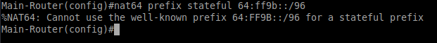
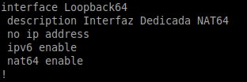
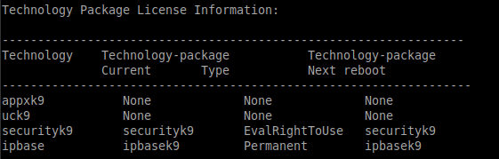
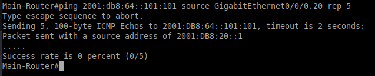
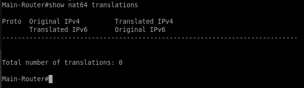

# INFORME TÉCNICO: JUSTIFICACIÓN DE LA NO IMPLEMENTACIÓN DE NAT64

**Curso:** Administración de Plataformas I
**Universidad Icesi**
**Fecha:** Noviembre 2025

---

## 1. CONTEXTO

El presente documento detalla las razones técnicas que impidieron la implementación exitosa del mecanismo de transición NAT64 (Stateful) en la infraestructura de red del proyecto.

El objetivo original era permitir que los clientes IPv6 accedieran a recursos de Internet IPv4 mediante la traducción de direcciones en el router de borde (Main-Router). Sin embargo, tras múltiples iteraciones de configuración y pruebas de diagnóstico, se determinó la inviabilidad de esta característica bajo las condiciones actuales de hardware y licenciamiento del router.

## 2. LIMITACIONES TÉCNICAS IDENTIFICADAS

El análisis exhaustivo del router **Cisco ISR 4321** con versión de software **IOS XE 03.16.04b.S (15.5)** reveló tres bloqueos críticos:

### 2.1 Conflicto de Recursos NAT (NVI)
El router presentó una incapacidad para procesar simultáneamente **NAT44** (requerido para la salida a internet de la red IPv4 existente) y **NAT64** sobre la misma interfaz física WAN (`GigabitEthernet0/0/1`) utilizando una única dirección IP pública dinámica (DHCP). El motor de NAT entra en conflicto al intentar gestionar ambas tablas de traducción sobre el mismo identificador de interfaz.

### 2.2 Incompatibilidad con Prefijo Estándar
La versión de IOS instalada rechaza explícitamente el uso del **Well-Known Prefix (WKP)** `64:ff9b::/96` en modo *stateful*. Al intentar configurar el estándar, el sistema arroja el error: `%NAT64: Cannot use the well-known prefix 64:FF9B::/96 for a stateful prefix`, obligando al uso de prefijos personalizados que añaden complejidad al enrutamiento y DNS.

### 2.3 Fallo en Arquitectura de Loopback
Se intentó una arquitectura alternativa utilizando una interfaz virtual `Loopback` para segregar el tráfico NAT64 del NAT44. Aunque la configuración fue aceptada sintácticamente, el tráfico de retorno (ICMP Reply / HTTP Response) es descartado silenciosamente por el procesador, resultando en un 100% de pérdida de paquetes, confirmado mediante `debug nat64 all` y trazas de paquetes.

## 3. PRUEBAS REALIZADAS

Para intentar mitigar estas limitaciones, se ejecutaron los siguientes procedimientos sin éxito:

1.  **Activación de Licencia:** Se habilitó correctamente la licencia `securityk9` (EvalRightToUse).

3.  **Configuración de Pools:** Se probaron pools NAT64 estáticos y dinámicos coincidentes con la IP WAN.
4.  **Bypass de Rutas:** Se manipuló la tabla de enrutamiento IPv6 (Rutas a Null0 y Loopback) para forzar la intercepción del tráfico.
5.  **Debug de Paquetes:** Las pruebas con `ping` y `curl` desde clientes Linux y Windows, así como desde el propio router, confirmaron que el mecanismo de traducción no se activa (estado "Zombie") cuando coexiste con NAT44.

## 4. CONCLUSIÓN

La implementación de NAT64 no es viable en el router asignado sin realizar una actualización mayor del sistema operativo (a versiones IOS XE 16.x Fuji/Everest) o sin la adición de una segunda dirección IP pública dedicada exclusivamente para IPv6.

Dado que ambas soluciones exceden el alcance, presupuesto y permisos del entorno de laboratorio actual, se decide **descartar NAT64**. La red operará en modalidad **Dual Stack puro**, garantizando conectividad IPv4 mediante NAT44 estándar y conectividad IPv6 interna mediante enrutamiento nativo y SLAAC, cumpliendo así con los objetivos fundamentales del curso.