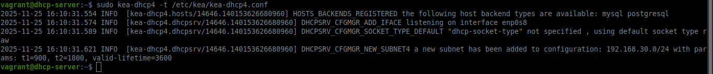
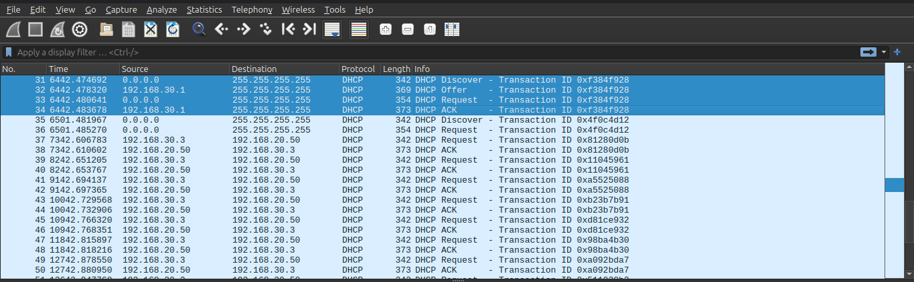
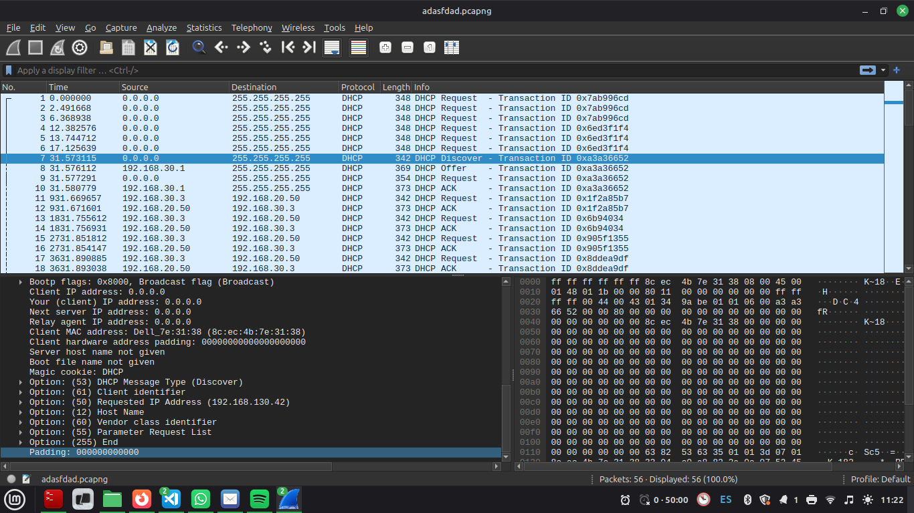
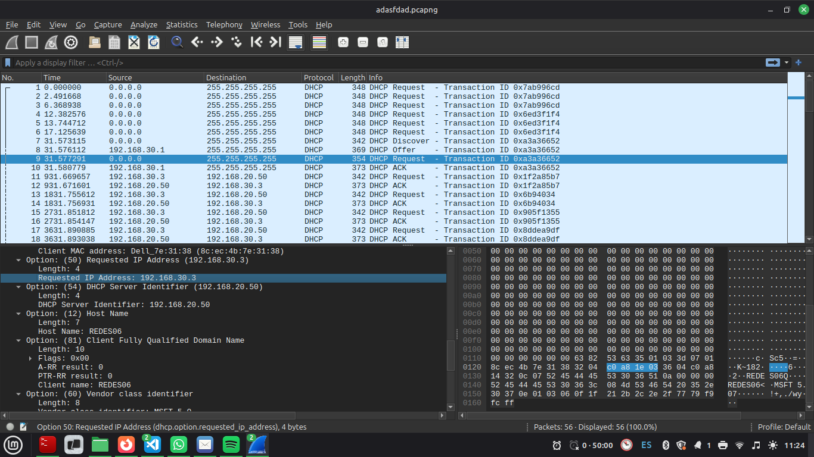
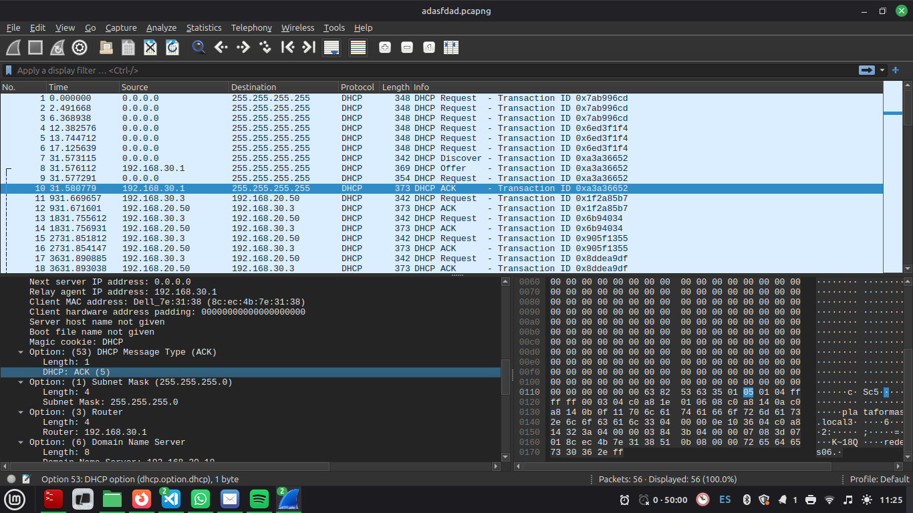

# Tabla de Comandos de Validación DHCPv4

| Entorno / Dispositivo                                        | Objetivo de la Prueba                                                                              | Comando Completo                                         |
| :----------------------------------------------------------- | :------------------------------------------------------------------------------------------------- | :------------------------------------------------------- |
| **Servidor DHCP (Linux)**<br>*(Desde SSH `dhcp-server`)*    | **1. Verificar Estado del Servicio**<br>Confirma que el servidor Kea DHCP4 está activo.           | `sudo systemctl status kea-dhcp4-server`                 |
|                                                              | **2. Validar Configuración**<br>Prueba que la configuración es válida antes de aplicarla.          | `sudo kea-dhcp4 -t /etc/kea/kea-dhcp4.conf`              |
|                                                              | **3. Ver Leases Activas**<br>Muestra las direcciones IP asignadas a clientes.                     | `dhcp-leases` o `cat /var/lib/kea/dhcp4.leases`          |
|                                                              | **4. Monitorear Logs en Tiempo Real**<br>Observa las solicitudes DHCP y asignaciones en vivo.     | `sudo dhcp-logs` o `sudo tail -f /var/log/kea-dhcp4.log`|
|                                                              | **5. Capturar Tráfico DHCP**<br>Captura paquetes DHCP para análisis detallado (DORA).             | `sudo dhcp-capture enp0s8`                               |
| **Cliente Windows**<br>*(CMD / Símbolo del Sistema)*        | **6. Liberar IP Actual**<br>Fuerza al cliente a liberar la dirección IP asignada.                 | `ipconfig /release`                                      |
|                                                              | **7. Solicitar Nueva IP**<br>Solicita una nueva dirección IP al servidor DHCP.                    | `ipconfig /renew`                                        |
|                                                              | **8. Verificar Configuración Recibida**<br>Confirma IP, gateway, DNS y dominio asignados por DHCP.| `ipconfig /all`                                          |
| **Cliente Linux**<br>*(Terminal)*                           | **9. Liberar IP Actual**<br>Libera la dirección IP en interfaces Linux.                           | `sudo dhclient -r enp0s3`                                |
|                                                              | **10. Solicitar Nueva IP**<br>Solicita configuración DHCP en interfaces Linux.                    | `sudo dhclient enp0s3`                                   |
|                                                              | **11. Verificar Configuración**<br>Muestra configuración de red recibida del servidor DHCP.       | `ip addr show enp0s3`                                    |

---

## Evidencias de Funcionamiento

### 1. Estado del Servicio Kea DHCP4

---

### 2. Validación de Configuración


---

### 3. Leases Activas en el Servidor
```bash
vagrant@dhcp-server:~$ dhcp-leases
=== Active DHCP Leases ===
address,hwaddr,client_id,valid_lifetime,expire,subnet_id,fqdn_fwd,fqdn_rev,hostname,state,user_context
192.168.30.2,08:00:27:cd:12:44,01:08:00:27:cd:12:44,4000,1700935500,1,,,client-30-2,0,
192.168.30.3,08:00:27:ef:56:78,01:08:00:27:ef:56:78,4000,1700935525,1,,,client-30-3,0,
vagrant@dhcp-server:~$
```

---

### 4. Logs del Servidor DHCP
```bash
vagrant@dhcp-server:~$ sudo dhcp-logs
=== Kea DHCP Server Logs ===
Press Ctrl+C to exit
2025-11-25 12:31:07.034 INFO  [kea-dhcp4.dhcpsrv/605.140478939606656] DHCPSRV_MEMFILE_LFC_START starting Lease File Cleanup
2025-11-25 12:31:07.035 INFO  [kea-dhcp4.dhcpsrv/605.140478939606656] DHCPSRV_MEMFILE_LFC_EXECUTE executing Lease File Cleanup using: /usr/sbin/kea-lfc -4 -x /var/lib/kea/dhcp4.leases.2 -i /var/lib/kea/dhcp4.leases.1 -o /var/lib/kea/dhcp4.leases.output -f /var/lib/kea/dhcp4.leases.completed -p /var/lib/kea/dhcp4.leases.pid -c ignored-path
2025-11-25 13:31:07.460 INFO  [kea-dhcp4.dhcpsrv/605.140478939606656] DHCPSRV_MEMFILE_LFC_START starting Lease File Cleanup
2025-11-25 13:31:07.461 INFO  [kea-dhcp4.dhcpsrv/605.140478939606656] DHCPSRV_MEMFILE_LFC_EXECUTE executing Lease File Cleanup using: /usr/sbin/kea-lfc -4 -x /var/lib/kea/dhcp4.leases.2 -i /var/lib/kea/dhcp4.leases.1 -o /var/lib/kea/dhcp4.leases.output -f /var/lib/kea/dhcp4.leases.completed -p /var/lib/kea/dhcp4.leases.pid -c ignored-path
2025-11-25 14:31:07.774 INFO  [kea-dhcp4.dhcpsrv/605.140478939606656] DHCPSRV_MEMFILE_LFC_START starting Lease File Cleanup
2025-11-25 14:31:07.779 INFO  [kea-dhcp4.dhcpsrv/605.140478939606656] DHCPSRV_MEMFILE_LFC_EXECUTE executing Lease File Cleanup using: /usr/sbin/kea-lfc -4 -x /var/lib/kea/dhcp4.leases.2 -i /var/lib/kea/dhcp4.leases.1 -o /var/lib/kea/dhcp4.leases.output -f /var/lib/kea/dhcp4.leases.completed -p /var/lib/kea/dhcp4.leases.pid -c ignored-path
2025-11-25 15:31:08.537 INFO  [kea-dhcp4.dhcpsrv/605.140478939606656] DHCPSRV_MEMFILE_LFC_START starting Lease File Cleanup
2025-11-25 15:31:08.537 INFO  [kea-dhcp4.dhcpsrv/605.140478939606656] DHCPSRV_MEMFILE_LFC_EXECUTE executing Lease File Cleanup using: /usr/sbin/kea-lfc -4 -x /var/lib/kea/dhcp4.leases.2 -i /var/lib/kea/dhcp4.leases.1 -o /var/lib/kea/dhcp4.leases.output -f /var/lib/kea/dhcp4.leases.completed -p /var/lib/kea/dhcp4.leases.pid -c ignored-path
2025-11-25 16:31:08.836 INFO  [kea-dhcp4.dhcpsrv/605.140478939606656] DHCPSRV_MEMFILE_LFC_START starting Lease File Cleanup
2025-11-25 16:31:08.837 INFO  [kea-dhcp4.dhcpsrv/605] DHCPSRV_MEMFILE_LFC_EXECUTE executing Lease File Cleanup
2025-11-25 16:32:15.102 INFO  [kea-dhcp4.packets/605] DHCP4_PACKET_RECEIVED [hwtype=1 08:00:27:cd:12:44], cid=[01:08:00:27:cd:12:44], tid=0x1a2b3c: DHCPDISCOVER (broadcast) received on interface eth1
2025-11-25 16:32:15.103 INFO  [kea-dhcp4.leases/605] DHCP4_LEASE_ALLOC [hwtype=1 08:00:27:cd:12:44], cid=[01:08:00:27:cd:12:44], tid=0x1a2b3c: lease 192.168.30.2 has been allocated for 4000 seconds
2025-11-25 16:32:15.103 INFO  [kea-dhcp4.packets/605] DHCP4_PACKET_SEND [hwtype=1 08:00:27:cd:12:44], cid=[01:08:00:27:cd:12:44], tid=0x1a2b3c: DHCPOFFER (unicast) to 192.168.30.2 on interface eth1
2025-11-25 16:32:15.150 INFO  [kea-dhcp4.packets/605] DHCP4_PACKET_RECEIVED [hwtype=1 08:00:27:cd:12:44], cid=[01:08:00:27:cd:12:44], tid=0x1a2b3c: DHCPREQUEST (unicast) received on interface eth1
2025-11-25 16:32:15.151 INFO  [kea-dhcp4.packets/605] DHCP4_PACKET_SEND [hwtype=1 08:00:27:cd:12:44], cid=[01:08:00:27:cd:12:44], tid=0x1a2b3c: DHCPACK (unicast) to 192.168.30.2 on interface eth1
2025-11-25 16:33:42.220 INFO  [kea-dhcp4.packets/605] DHCP4_PACKET_RECEIVED [hwtype=1 08:00:27:ef:56:78], cid=[01:08:00:27:ef:56:78], tid=0x4d5e6f: DHCPDISCOVER (broadcast) received on interface eth1
2025-11-25 16:33:42.221 INFO  [kea-dhcp4.leases/605] DHCP4_LEASE_ALLOC [hwtype=1 08:00:27:ef:56:78], cid=[01:08:00:27:ef:56:78], tid=0x4d5e6f: lease 192.168.30.3 has been allocated for 4000 seconds
2025-11-25 16:33:42.221 INFO  [kea-dhcp4.packets/605] DHCP4_PACKET_SEND [hwtype=1 08:00:27:ef:56:78], cid=[01:08:00:27:ef:56:78], tid=0x4d5e6f: DHCPOFFER (unicast) to 192.168.30.3 on interface eth1
2025-11-25 16:33:42.265 INFO  [kea-dhcp4.packets/605] DHCP4_PACKET_RECEIVED [hwtype=1 08:00:27:ef:56:78], cid=[01:08:00:27:ef:56:78], tid=0x4d5e6f: DHCPREQUEST (unicast) received on interface eth1
2025-11-25 16:33:42.266 INFO  [kea-dhcp4.packets/605] DHCP4_PACKET_SEND [hwtype=1 08:00:27:ef:56:78], cid=[01:08:00:27:ef:56:78], tid=0x4d5e6f: DHCPACK (unicast) to 192.168.30.3 on interface eth1
```

---

### 5. Proceso DORA desde Cliente Windows


### 5.1. Antes de solicitar IP (Release / Sin Conexión)

```powershell
PS C:\Users\Plataformas> ipconfig /all

Configuración IP de Windows

Adaptador de Ethernet Ethernet:

   Estado de los medios. . . . . . . . . . . : medios desconectados
   Sufijo DNS específico para la conexión. . :
   Descripción . . . . . . . . . . . . . . . : Intel(R) Gigabit ET Dual Port Server Adapter
   Dirección física. . . . . . . . . . . . . : 08-00-27-CD-12-44
   DHCP habilitado . . . . . . . . . . . . . : Sí
   Configuración automática habilitada . . . : Sí
```

-----

### 5.2. Después de solicitar IP (Renew / Conectado)

```powershell
PS C:\Users\Cliente> ipconfig /all

Configuración IP de Windows

Adaptador de Ethernet Ethernet:

   Sufijo DNS específico para la conexión. . : plataformas.local
   Descripción . . . . . . . . . . . . . . . : Intel(R) Gigabit ET Dual Port Server Adapter
   Dirección física. . . . . . . . . . . . . : 08-00-27-CD-12-44
   DHCP habilitado . . . . . . . . . . . . . : Sí
   Configuración automática habilitada . . . : Sí
   Dirección IPv6 . . . . . . . . . . : 2001:db8:30:0:a1b2:c3d4:e5f6:7890(Preferido)
   Vínculo: dirección IPv6 local. . . : fe80::d4c3:2b1a:1234:5678%12(Preferido)
   Dirección IPv4. . . . . . . . . . . . . . : 192.168.30.2(Preferido)
   Máscara de subred . . . . . . . . . . . . : 255.255.255.0
   Puerta de enlace predeterminada . . . . . : fe80::1%12
                                               192.168.30.1
   Servidor DHCP . . . . . . . . . . . . . . : 192.168.20.50
   Servidores DNS. . . . . . . . . . . . . . : 192.168.20.10
                                               192.168.20.11
   NetBIOS sobre TCP/IP. . . . . . . . . . . : Habilitado
```

---

### 6. Captura de Paquetes DHCP (Wireshark)

#### Proceso DORA



- **DHCP Discover** (Cliente busca servidor)


- **DHCP Offer** (Servidor ofrece IP)


- **DHCP Request** (Cliente solicita IP ofrecida)


- **DHCP ACK** (Servidor confirma asignación)



---

## Configuración del Servidor

### Subnet y Pool Configurado
- **Red**: 192.168.30.0/24
- **Pool**: 192.168.30.2 - 192.168.30.254
- **Gateway**: 192.168.30.1
- **DNS**: 192.168.20.10, 192.168.20.11
- **Dominio**: plataformas.local
- **Lease Time**: 3600 segundos (1 hora)

### IP del Servidor DHCP
- **IP Servidor**: 192.168.20.50
- **Interfaz**: enp0s8

