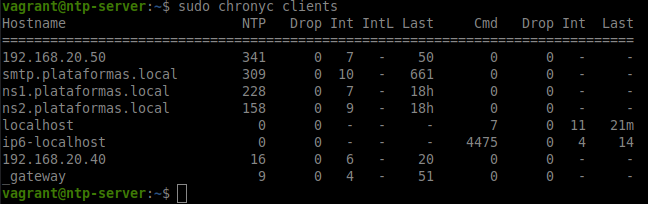
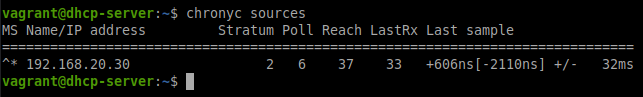
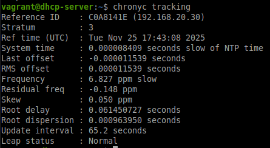
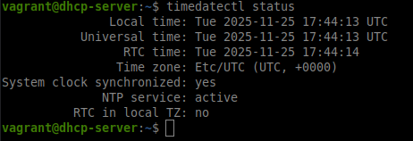
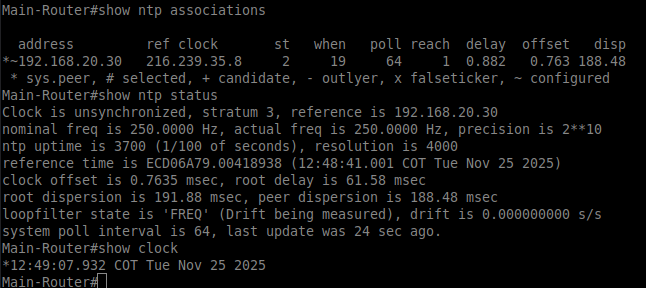

# Tabla de Comandos de Validación NTP

## Descripción

Este documento presenta las pruebas de funcionamiento del servidor NTP implementado con Chrony. El servidor sincroniza con fuentes públicas (Google, Cloudflare) y provee tiempo preciso a toda la infraestructura, garantizando:

- Correlación correcta de logs entre servidores
- Validación de certificados TLS (servidor Email)
- Funcionamiento correcto de DNSSEC (firmas temporales)
- Sincronización de leases DHCP
- Timestamps precisos en el sistema de monitoreo

---

## Comandos de Validación

| Entorno / Dispositivo                                     | Objetivo de la Prueba                                                                              | Comando Completo                                         |
| :-------------------------------------------------------- | :------------------------------------------------------------------------------------------------- | :------------------------------------------------------- |
| **Servidor NTP (Linux)** *(Desde SSH `ntp-server`)*   | **1. Verificar Estado del Servicio** Confirma que el servidor Chrony está activo.              | `sudo systemctl status chrony`                           |
|                                                           | **2. Ver Fuentes de Tiempo** Muestra los servidores NTP upstream y su estado.                  | `chronyc sources -v`                                     |
|                                                           | **3. Verificar Tracking** Muestra el estado de sincronización y offset del servidor.           | `chronyc tracking`                                       |
|                                                           | **4. Ver Clientes Conectados** Lista los clientes que han consultado al servidor NTP.          | `chronyc clients`                                        |
|                                                           | **5. Ver Actividad en Tiempo Real** Muestra estadísticas de actividad del servidor.            | `chronyc activity`                                       |
| **Cliente Linux** *(Terminal)*                        | **6. Verificar Sincronización** Muestra las fuentes NTP configuradas y su estado.              | `chronyc sources`                                        |
|                                                           | **7. Ver Estado de Tracking** Muestra offset, stratum y precisión de sincronización.           | `chronyc tracking`                                       |
|                                                           | **8. Verificar Hora del Sistema** Muestra configuración de hora y sincronización NTP.          | `timedatectl status`                                     |
|                                                           | **9. Forzar Sincronización** Fuerza ajuste inmediato del reloj del sistema.                    | `sudo chronyc makestep`                                  |
| **Router Cisco** *(CLI)*                              | **10. Verificar Asociaciones NTP** Muestra servidores NTP configurados y su estado.            | `show ntp associations`                                  |
|                                                           | **11. Ver Estado NTP** Muestra estado general de sincronización NTP.                           | `show ntp status`                                        |

---

## Evidencias de Funcionamiento

### 1. Estado del Servicio Chrony en el Servidor

---

### 2. Fuentes de Tiempo Upstream (Sources)

---

### 3. Estado de Tracking del Servidor

---

### 4. Clientes Conectados al Servidor NTP

---

### 5. Cliente Linux Sincronizado con Servidor NTP

#### 5.1. Fuentes NTP en Cliente

#### 5.2. Estado de Tracking en Cliente

#### 5.3. Estado del Sistema

---

### 6. Router Cisco Sincronizado

---
## Configuración del Servidor

### Servidores Upstream
- **time.google.com** (preferido)
- **time.cloudflare.com** (respaldo)

### Redes Permitidas
- **192.168.10.0/24** (Administración)
- **192.168.20.0/24** (Servidores)
- **192.168.30.0/24** (Clientes)

### Parámetros de Sincronización
- **Stratum local**: 10 (modo aislado si falla internet)
- **Makestep**: 1.0 segundos, máximo 3 veces
- **Puerto**: UDP 123
- **Logs**: /var/log/chrony/

### IP del Servidor NTP
- **IP Servidor**: 192.168.20.30
- **Interfaz**: Todas (0.0.0.0)
